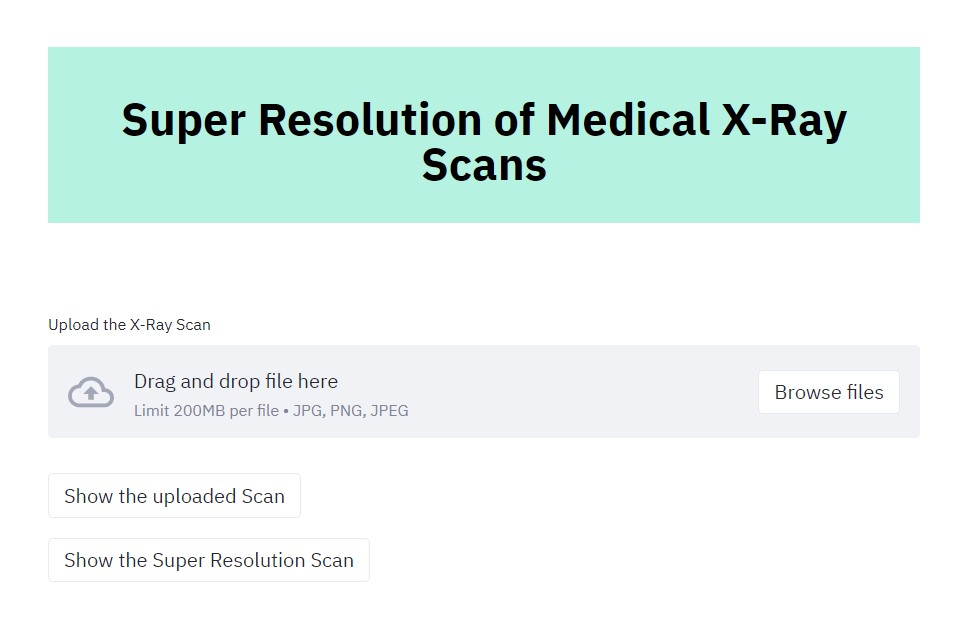

# Super Resolution of Medical X-Ray Scans
[](https://pypi.python.org/pypi/yt2mp3/)





I have implemented the Super Resolution Convolutional Neural Network model on custom X-Ray Scans dataset. The model achieved 42.47 PSNR on the test set. I have also made an app using StreamLit.

### Dataset
You can download the train and test data for personal use. I have not provided a training file because the main purpose is to have an app that can aid doctors by providing X2 zoomed high resolution X-Ray scans.

<br>

|  Type | Link  |
| :------------: | :------------: |
|  Train set | [Download](https://drive.google.com/file/d/1-METyaUAiTfK86xO6HJoNu0JdvVyKHdh/view?usp=sharing "Download")  |
|  Test set |  [Download](https://drive.google.com/file/d/1-Ji_E3fYbFNd-M9mctPDS1vGRcrrr5Rk/view?usp=sharing "Download") |

### Requirements

```
numpy
torch==1.7.1+cpu
streamlit==0.77.0
Pillow==8.1.1

```
```python
# Install using pip
pip install -r requirements.txt
```

### Running the App

 Open the Root directory and run the following command in your terminal.

`streamlit run app.py`

This will output the URL, open it in your browser. You can then upload the X-ray Scan and get the SRCNN X2 output image.
